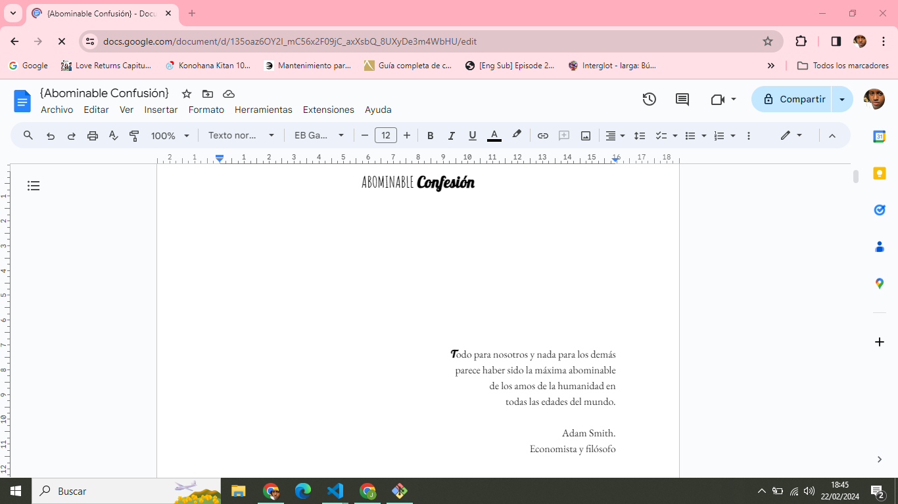
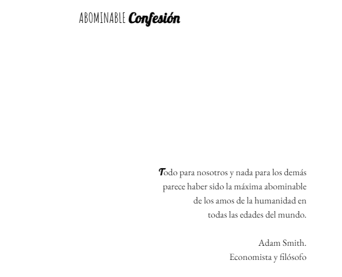
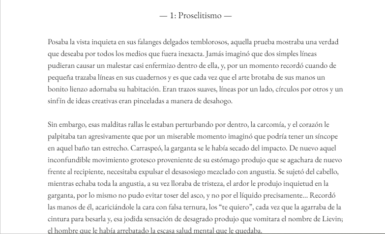

# EJERCICIO 5
### Como he hecho mi historia 🧡📙
#### El primer paso para hacer mi hostoria ha sido la disciplina, las ganas y el amor. Aquí adjuntaré una imagen, para mostrar:

#### Desde muy pequeña me ha apasionado el mundo de la lectura en todas sus formas; ya sea digital, en físico, no importa, la cosa era perderme entre cada fuente, cada parrafo y cada línea de lo que fuera que estaba absorviendo mi mente. 

#### Dejaré por aquí una segunda imagen para que se aprecie mejor. 

#### La portadilla ya de por sí, se ve bastante interesante por el llamativo título y su profundo poema. Quiero transmitir con cada palabra lo siginificativo que es el título y el porqué el emblematico nombre. La historia conlleva detrás; mucho romance, pasión, venganza, desilusión y bastante superación personal por parte de la protagonista.
#### Añadiré otra imagen para mostrar como empieza el capítulo 1. 

